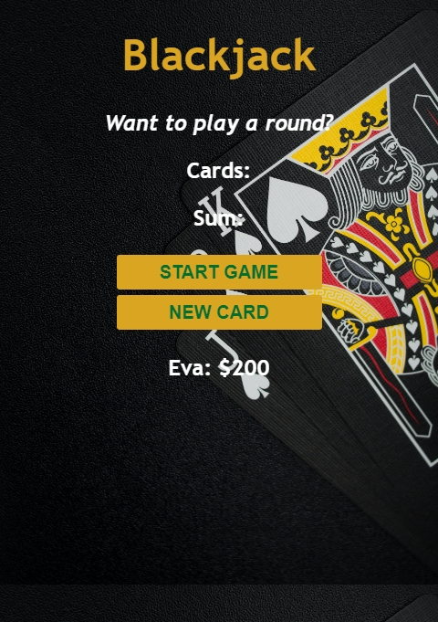

# Scrimba - Build A Blackjack Game

This is a solution to [Scrimba - Build A Blackjack Game](https://scrimba.com/learn/frontend) found in Module 3 for The Frontend Developer Career Path from Scrimba. 

## Table of contents

- [Scrimba - Build A Blackjack Game](#scrimba---build-a-blackjack-game)
  - [Table of contents](#table-of-contents)
  - [Overview](#overview)
    - [The challenge](#the-challenge)
    - [Screenshot](#screenshot)
    - [Links](#links)
  - [My process](#my-process)
    - [Built with](#built-with)
    - [What I learned](#what-i-learned)
    - [Continued development](#continued-development)
  - [Author](#author)

## Overview

### The challenge

Learn new programming concepts:
- Arrays
- Objects
- Booleans
- if else statements
- compaariosn operators
- logical operators
- for loops
- The Math object (for JavaScript)
- return statements

### Screenshot




### Links

- Solution URL: [Github Repo](https://github.com/varonalearns/Blackjack)
- Live Site URL: [Netlify Live Site](https://golden-babka-d60535.netlify.app/)

## My process

### Built with

- CSS custom properties
- Flexbox
- Vanilla JavaScript

### What I learned

I was having some issues with the JavaScript not working until I started to debug and found that I had forgotten to complete a for loop, resulting in the JavaScript not working. 

What the problem was:

```js
  for (let i = 0; cards.length; i++) {
      cardsEl.textContent += cards[i] + " "
  }
```
And the fix:

```js
  for (let i = 0; i < cards.length; i++) {
      cardsEl.textContent += cards[i] + " "
  }
```
So beyond learning a bunch of new programming concepts, I also learned how to debug code.

### Continued development

I will continue to develop my debugging skills so I can catch issues as detailed above far quicker rather than banging my head against a wall.

## Author

- Website - [Evalia Varona](https://www.evaliavarona.com)
- Hashnode - [@evavarona](https://evaliavarona.hashnode.dev)